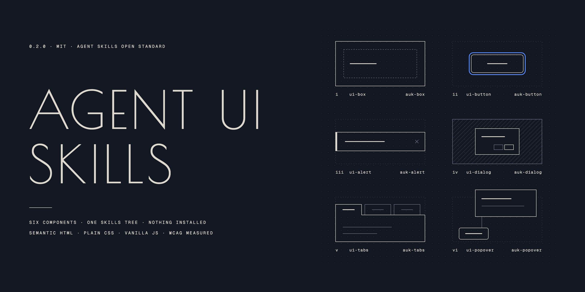

# Agent UI Skills



Vendor-neutral UI component skills for AI coding agents.

Each component skill describes one UI component and ships a complete reference: semantic HTML
with a real accessibility contract, plain CSS driven by custom properties, and
dependency-free JavaScript. An agent reads the reference and builds the component
into your project, in your stack.

There is nothing to install into your app. The canonical references require no
framework, no design system, no package and no vendor. Each component in Agent UI
Skills also ships a required React projection demo that shows how to wrap the
same DOM contract in typed props when a consuming app already uses React. That
demo is reference material, not production code.

## Status

Version 0.4.0. Eight skills ship: six components - **box**, **button**, **alert**,
**dialog**, **tabs** and **popover** - and two workflows: **theme**, which binds a
project's existing colours, radius and type to the components' custom properties,
and **compose**, which shapes how a component is emitted into a project built from
components. The components were chosen to stress different parts of the format
rather than to be a useful catalog - a purely presentational primitive, no
JavaScript, a live region, heavy focus management, keyboard navigation, and a
non-modal layer in the browser's top layer. Their skill names are prefixed for
discovery: `ui-box`, `ui-button`, `ui-alert`, `ui-dialog`, `ui-tabs`, `ui-popover`,
`ui-theme` and `ui-compose`.

`ui-compose` is the skill that shapes output for a component-based project: props
typed from the contract table, a split only where a prop changes which parts render,
sibling auk components composed rather than re-typed, and a component that renders
alone. Every component skill's Build it points at it, so the set is meant to ship
together: a selective install of one component skill still carries the four rules on
that line, but the mapping itself lives in `ui-compose`.

Both vendors load the tree and use it: see [docs/vendor-support.md](docs/vendor-support.md)
for what actually happened, including what did not work.

The reference format is still moving - pin a commit if you depend on it.

## Fits your design system

Every brand-bearing value chains to one of 23 semantic roles, so a brand is at most
23 lines. Copy `skills/ui-theme/references/auk-roles.css` in, then bind the roles:

```css
:root {
  --auk-role-primary: var(--color-action-primary);
  --auk-role-on-primary: var(--color-action-on-primary);
  --auk-role-text: var(--color-text-default);
  --auk-role-surface: var(--color-surface-default);
  --auk-role-border: var(--color-border-default);
  --auk-role-radius: var(--radius-md);
  --auk-role-font: var(--font-sans);
}
```

Every unbound role keeps its shipped default. The same roles ship as
`skills/ui-theme/references/auk.tokens.json`, a DTCG 2025.10 token file for a token
build or, vendor-specific, a Figma or Penpot import. Procedure: [docs/theming.md](docs/theming.md).

## Install

The repository is both a plugin and its own marketplace.

**Skills CLI**

```
npx skills add shawn-sandy/agent-ui-skills
```

One command installs the eight skills into Claude Code, Codex, Cursor, Copilot and the
other agents the CLI supports.

**Claude Code**

```
/plugin marketplace add shawn-sandy/agent-ui-skills
/plugin install agent-ui-skills@agent-ui-skills
```

**ChatGPT / Codex**

Install from the plugin directory, or add this repository to a workspace marketplace.

**Any other agent**

Skills follow the [Agent Skills open standard](https://agentskills.io/specification).
Copy any folder from `skills/` into your agent's skills directory, keeping its
`ui-` prefix.

## Layout

```
agent-ui-skills/
├── .claude-plugin/
│   ├── plugin.json         # Claude Code plugin manifest
│   └── marketplace.json    # Claude Code marketplace, source "./"
├── .codex-plugin/
│   └── plugin.json         # ChatGPT / Codex plugin manifest
├── skills/                 # one directory per skill
│   └── ui-<component>/
│       ├── SKILL.md        # what it is, when to use it, how to build it
│       └── references/
│           ├── ui-<component>.md   # contract, HTML, CSS, JS, accessibility
│           ├── demo.html        # standalone, opens from disk
│           └── react-demo.tsx   # required typed React projection reference
├── evals/                  # skill-triggering scenarios, at least three per skill
├── tests/                  # frontmatter, manifests, and browser suites
├── scripts/
│   ├── check.sh            # the single local gate
│   └── build-demos.mjs     # rewrites each demo's component code from its reference
└── docs/                   # specification, evaluations, vendor results
```

One `skills/` tree serves every vendor. The manifests are thin and additive; there
is no build step and no duplicated content.

The `ui-` prefix belongs to the skill identity only. Component DOM contracts stay
unprefixed: the button skill still ships `auk-button`, `--auk-button-*`,
`initButton` and `AukButtonProps`.

## Verifying it

```
npm install && npx playwright install chromium
bash scripts/check.sh
```

Six gates run in order: the unit, objective and integration suites; a portability
lint over `skills/`; a check that no file under `skills/` loads an external
resource; a check that every demo still matches its reference;
`claude plugin validate . --strict`; and the browser suite, which drives every demo
with the keyboard and scans it with axe-core.

`bash scripts/check.sh --prove` additionally runs a deliberately broken fixture
through the gate to show it can fail.

Every demo also opens directly from disk with no server, no build step and no
stylesheet beyond the reference's own CSS:

```
open skills/ui-dialog/references/demo.html
```

A demo inlines its component's CSS and JavaScript so it stays self-contained, which
means that code exists twice. The second copy is generated, not hand-kept:

```
node scripts/build-demos.mjs           # rewrite every demo from its reference
node scripts/build-demos.mjs --check   # report stale demos, write nothing
```

Edit the reference and re-run it. `scripts/check.sh` runs `--check` as a gate, so a
demo that drifts from its reference fails the build.

## Documentation

- [docs/component-spec.md](docs/component-spec.md) - the authoring contract for
  `SKILL.md` and the reference.
- [docs/evaluations.md](docs/evaluations.md) - whether a realistic request actually
  reaches the right skill, measured across three models.
- [docs/vendor-support.md](docs/vendor-support.md) - what each vendor did with the
  tree, including the failures.
- [docs/theming.md](docs/theming.md) - the four doors into a component's styling, and
  the layer order a project declares so its own reset does not undo one.
- [docs/properties.md](docs/properties.md) - every `--auk-*` property with its
  fallback and kind, generated from the references.

## Principles

- **Semantic HTML first.** Correct elements and ARIA, no opinion imposed on class names.
- **Plain CSS.** Custom properties with fallbacks, so a component works standalone
  and themes cleanly when a design system is present.
- **Vanilla JavaScript.** No dependencies. Port it to your framework if you want to.
- **Accessibility is not optional.** Every reference states the WCAG criteria it
  satisfies, including keyboard handling and focus management.

## License

MIT
