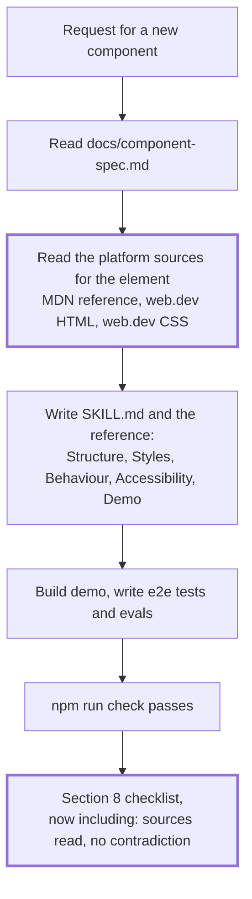

# Platform sources for component authoring

## At a glance

| Changes | Files | Decisions | Open items |
| --- | --- | --- | --- |
| 1 commit | 1 file, 16 lines added | 3 | 3 |

The repository now names three web pages that anyone writing a component skill must read
first: the MDN HTML reference, web.dev's HTML hub and web.dev's CSS hub. The rule lives in
the authoring contract, `docs/component-spec.md`, so it reaches every future component
without touching any other file. The change is on pull request #23, which passed every
check and is waiting for a merge decision.

## What changed

### Component authors now have a fixed reading list

- **Who it affects.** Teammates and agents who write or edit a component skill under
  `skills/`. End users of the components see nothing different.
- **What is different now.** Section 0 of `docs/component-spec.md`, the part that fixes
  conventions once so nobody re-decides them, has a new `Sources` block. It says: before
  writing a component's Structure, Styles or Behaviour, read the MDN page for the root
  element and each named part, plus web.dev's HTML and CSS hubs. A reference may not
  contradict those pages, and where the platform already supplies a native attribute,
  method or event that does the job, the component uses it instead of a scripted copy. The
  section 8 checklist gained one matching line, so a finished component has to tick it.
- **How to reach it.** `docs/component-spec.md`, section 0, heading `Sources`. The three
  links: https://developer.mozilla.org/en-US/docs/Web/HTML/Reference, https://web.dev/html,
  https://web.dev/css.

### The change shipped as pull request #23

- **Who it affects.** Reviewers and whoever merges.
- **What is different now.** One commit, `1d313f2`, on branch
  `claude/dialog-component-reference-26b5d3`. The full local gate, `npm run check`, passed
  all six of its checks before the PR was opened, including 76 browser tests. On GitHub the
  merge state is clean and both CI jobs are green. Two bots commented; neither finding
  changed the PR (see Decisions).
- **How to reach it.** https://github.com/shawn-sandy/agent-ui-skills/pull/23

## How it works now

The authoring flow gained one mandatory step at the front and one line at the end. The
diagram shows the path a new component takes, with the two new pieces marked.

Caption: the boxed steps are new. Everything else in the flow already existed.

## Before and after

| Rule | Before | After |
| --- | --- | --- |
| What an author reads before writing a component | Nothing stated. Each skill reasoned from the HTML and ARIA specs implicitly. | Three fixed sources, named in section 0 of the spec. |
| Native platform feature versus scripted copy | Implied per skill, for example the dialog skill's ban on hand-written `role="dialog"`. | Stated once for every component: use the native attribute, method or event when the source documents one. |
| Done checklist in section 8 | 11 items. | 12 items. The new one: sources read, reference does not contradict them. |
| Scope of the request | First message named only the MDN `<dialog>` page. | Second message broadened it to the MDN HTML reference plus the two web.dev hubs. |
| Pull request | None. | #23, open, CI green, not merged. |

## Decisions

### Put the rule in the spec, not in CLAUDE.md, the new-component command, or each skill

- **Why.** `docs/component-spec.md` is the authoring contract. The project's CLAUDE.md
  says it wins on any conflict, and the `/new-component` command reads it in full as step
  one and says it does not restate spec rules. A rule placed there reaches every future
  component with zero other edits.
- **Rejected: CLAUDE.md.** It already delegates authoring rules to the spec. Duplicating
  the rule there would create two places that can disagree.
- **Rejected: the `/new-component` command.** Its own text says the spec holds every rule.
- **Rejected: a `Sources` line in each `references/ui-<component>.md`.** The spec fixes a
  reference's shape to exactly five sections, and the test suite pins their order. A
  citation could still go in prose, but that is for consuming agents, not authors, and was
  deferred (see Open items).

### Keep the web.dev hub URLs the user asked for, not the `/learn/` pages a bot suggested

- **Why.** The `claude-review` bot said `https://web.dev/html` and `https://web.dev/css`
  were likely dead and proposed `/learn/html` and `/learn/css`. A direct HTTP check showed
  both hub URLs return 200 with no redirect, and an earlier fetch showed they are web.dev's
  HTML and CSS index pages, which link to those very courses. They are also the exact URLs
  the user gave. Under the review-bot triage rules the finding is an incorrect claim that
  blocks nothing, so it was reported to the user rather than fixed or replied to.
- **Rejected: swapping to the `/learn/` pages.** Would change what the user asked for on
  the strength of a false premise.
- **Rejected: replying on the thread.** The rules say replies are for humans; a bot forgets
  between runs, and the finding was not blocking.

### Read the request as "record the sources", not "audit the dialog against MDN"

- **Why.** The first message was ambiguous between the two. The branch was already named
  `dialog-component-reference`, which points at recording a reference. A spot check of the
  shipped dialog skill against MDN's `<dialog>` page was done anyway and found no
  contradiction: `showModal()` over `show()`, no hand-written role or `aria-modal`, native
  `autofocus`, no `tabindex` on the dialog, a `::backdrop` rule, close handled through the
  `close` event.
- **Rejected: editing the dialog skill.** Nothing needed changing, and the second message
  confirmed the broader reading.

## Learnings

- **Verify a link before changing a citation.** A review bot inferred that two URLs were
  wrong from a convention elsewhere in the repo. One HTTP request settled it. The bot's
  reasoning was plausible and its conclusion was false.
- **No test parses the spec.** A change to `docs/component-spec.md` is verified by reading
  it back and by the gates staying green, not by any assertion. The new checklist line is
  enforced by the human or agent working the checklist, nothing else.
- **zsh gotcha.** A shell word starting with `=` is expanded as a command path in zsh, so
  `echo =====` as a separator fails with `===== not found`. Quote separators or use `-----`.

## Open items

- **Merge decision on PR #23.** Everything is green and the merge state is clean. Merging
  was not authorised in the session and needs an explicit go-ahead.
- **Per-skill source citation.** A prose line in each `references/ui-<component>.md`
  naming the MDN page it was built against would let the citation travel with the skill to
  consuming agents. Deferred because the spec rule already reaches authors. If picked up:
  prose only, no new `##` heading, since the reference shape is fixed at five sections.
- **The bot thread on `docs/component-spec.md` line 55 is open.** It was left unreplied
  and unresolved on purpose, per the review-bot triage rules. Anyone who wants the PR page
  tidy can resolve it by hand; the evidence is in the Decisions section above.

## Files touched

**Authoring contract**

- `docs/component-spec.md` — section 0 gained the `Sources` block; the section 8 checklist
  gained one line. 16 lines added, nothing removed.

**Session record**

- `docs/plans/sessions/add-component-authoring-sources-session.md` — this recap, the
  committed record that holds the published artifact URL.

## Glossary

- **Agent Skill** — a folder with a `SKILL.md` that an AI coding agent reads to learn how
  to do one thing; this repository ships UI components in that form instead of as a library.
- **Authoring contract** — `docs/component-spec.md`, the document every component skill
  must follow; it wins over any other instruction file on conflict.
- **Reference file** — `skills/ui-<component>/references/ui-<component>.md`, the file that
  carries a component's markup, styles, script and accessibility contract in five fixed
  sections.
- **`/new-component`** — the repository's internal command that walks an agent through
  scaffolding a new component skill.
- **Section 0 / section 8** — the spec's "conventions fixed once" section and its
  end-of-work checklist.
- **MDN** — Mozilla Developer Network, the standard reference documentation for web
  platform features.
- **web.dev** — Google's developer education site; its HTML and CSS hubs index courses and
  articles.
- **`showModal()`** — the native browser method that opens a `<dialog>` as a modal, making
  the rest of the page unreachable without any custom script.
- **Gate / `npm run check`** — the repository's single local check; it runs six gates
  including unit tests, a portability lint and the browser suite.
- **Playwright** — the browser-automation tool that runs the end-to-end tests.
- **Vitest** — the unit test runner.
- **CI** — continuous integration: the checks GitHub runs automatically on a pull request.
- **CodeRabbit / claude-review** — the two automated review bots on this repository.
- **Review-bot triage rules** — the maintainer's standing rule set for bot comments:
  verify a claim before fixing it, report declined findings to the user, never treat a
  re-fired review as a new instruction.
- **Worktree** — a separate checkout of the same git repository in its own folder, so one
  branch can be worked on without disturbing another.
- **PR** — pull request, a proposed change on GitHub that others review before it merges.
